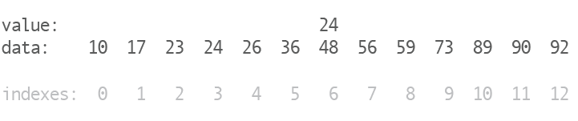

# Упражнения на алгоритмы: Бинарный поиск

## Введение

В предыдущей задаче ты написал(а) алгоритм линейного поиска для того, чтобы осуществить работу поиска, который имитирует поведение метода `indexOf()`. В этой задаче ты реализуешь тот же процесс, только используя другой алгоритм: бинарный поиск.

## Линейный поиск

В линейном поиске ты просматриваешь по одному элементу за раз. Чем больше массив, тем больше сравнений твоей программе нужно было сделать во время поиска необходимого ей объекта. Другими словами, связь между размером массива и количеством операций, которые должна выполнить программа, является линейной, поскольку они увеличиваются на этапе блокировки.

Линейный поиск очень полезен и очень прост, но представь себе массив с миллионом элементов. В худшем случае ты можешь искать элемент в конце этого длинного массива. Линейный поиск должен будет сделать 999,999 проверок, прежде чем он наконец доберется до этого последнего элемента!

Существует ли более эффективный способ?

## Более эффективный поиск

Давай рассмотрим поиск по большому списку элементов, которые уже отсортированы. Словари - отличный пример сортированного набора данных. Мы имеем тысячи слов в одном словаре, отсортированном по алфавиту. Если бы тебе пришлось искать слово в словаре, как бы ты это сделал(а)?

Если бы ты искал(а) слово линейным поиском, ты начал(а) бы на странице 1 в «А» и прокладывал(а) бы себе путь до тех пор, пока не найдешь свой результат. На практике, однако, мы этого никогда не делаем.

Более общий подход заключается в том, чтобы открыть словарь где-то посередине и выяснить, нужно ли продолжить поиск влево или вправо. Если мы ищем слово «Золотой», а страница, которую мы открываем, имеет слово «Салат», мы знаем, что нам нужно идти влево, потому что «З» идёт раньше чем «С».

Если мы ищем влево, мы будем игнорировать правую половину словаря и разделять левую половину где-то посередине. На этот раз мы можем приземлиться в «Д», что означает, что нам на этот раз нужно искать в правой части. Если мы продолжим, мы, в конце концов, найдем наше слово или обнаружим, что оно вообще отсутствует в словаре.

Подумай, что здесь происходит. Как этот подход сопоставим с линейным поиском? Что будет быстрее? Если отношение линейного поиска к размеру массива является линейным, то верно ли то же самое и для нашего нового подхода?

## Бинарный поиск

Стратегия поиска слова в словаре, о которой мы говорили выше, действительно представляет собой бинарный поиск. Он называется «бинарным», потому что каждый раз, когда ты открываешь словарь и решаешь идти влево или вправо, ты делаешь бинарный (двоичный) выбор. Этот двоичный выбор означает, что твое «пространство поиска» уменьшается с каждым шагом на половину. Это резко контрастирует с подходами «один на один», который предлагает нам линейный поиск.

Если описать метод бинарного поиска в псевдокоде, это будет выглядеть так:

1. Выбери точку в середине.
2. Сравни то, что находится в середине, с тем, что необходимо найти.
3. Если ты нашел(ла) то, что искал(а) - поиск окончен!
4. Если ты не нашел(ла) то, что искал(а), выбери левую или правую половину, чтобы продолжить поиск.
5. Примени тот же процесс к выбранной половине.

Вот анимация, которая делает это в списке отсортированных номеров:

*Рисунок 1*. Поиск в упорядоченном наборе данных с использованием алгоритма бинарного поиска.

## Скрытая сложность

На первый взгляд, написание алгоритма бинарного поиска может показаться простым заданием, но очень часто в его алгоритме можно найти ошибки. В книге *Programming Pearls* Джон Бентли писал, что за два часа, 90% профессиональных программистов не смогли написать правильную реализацию бинарного поиска. Правда они писали на `C` и им нельзя было тестировать свой код. Дональд Кнут в книге *Искусство программирования* писал, что хотя первый бинарный поиск был опубликован в 1946 году, первый поиск без ошибок не был опубликован до 1962 года. Использование TDD подхода к разработке может помочь тебе избежать ошибок в твоем алгоритме.
Когда ты выполняешь детально-ориентированную работу, крайне важно быть методичным и последовательным в своем подходе.

## Ограничения

Твое решение должно быть рекурсивным. Двоичный поиск является классическим рекурсивным алгоритмом и предлагает хорошую практику.

Тебе также необходимо выполнить эту задачу, не полагаясь на встроенные в JS методы массива `map/reduce/flter`.

### Релиз 0. Реализация двоичного поиска

Теперь давай реализуем наш метод бинарного поиска `binarySearch`. Этот метод должен искать элемент в массиве и возвращать его индекс или `-1`, если элемент не находится в массиве.

Например, если ты ищешь `G` в массиве `[A, B, C, D, E, F, G, H]`, твой метод должен возвращать 6. Если ты ищешь `X`, он должен возвращать `-1`. Твой метод может подразумевать, что любой полученный массив уже отсортирован.

Однако не погружайся сразу в реализацию - сделай предварительное планирование и псевдокодирование.

Помни первоначальный план:

1. Выбери точку в середине.
2. Сравни то, что находится в середине, с тем, что необходимо найти.
3. Если ты нашел(ла) то, что искал(а) - поиск окончен!
4. Если ты не нашел(ла) то, что искал(а), выбери левую или правую половину, чтобы продолжить поиск.
5. Примени тот же процесс к выбранной половине.

Конечно, этого недостаточно, чтобы найти элемент, поскольку тебе нужно выяснить, как вернуть индекс этого элемента. Сделай это шаг за шагом.

#### Важное значение имеет тестирование

Для этой задачи не было написано никаких тестов. Тебе нужно будет написать их самостоятельно для того, чтобы определить, работает ли твой метод должным образом. Ты можешь попытаться свести к минимуму вероятность введения ошибок в свой алгоритм бинарного поиска, используя подход, основанный на тестах. Можно начать с простого и постепенно усложнять. Работает ли твой метод, когда массив, который ты ищешь, пуст? Что делать, если в массиве один элемент, два элемента и т.д.? Существуют ли другие крайние случаи, которые тебе необходимо проверить?

### Релиз 1. Рефакторинг

Прежде чем завершить эту задачу, еще раз перечитай свой код, чтобы узнать, можешь ли ты его как-нибудь улучшить. Следуешь ли ты "Руководству по стилю JavaScript" (например, интервалы и отступы)? Могут ли имена твоих переменных быть более осмысленными? Есть ли проблемы в коде, которые ты можешь устранить? Например, есть ли какие-либо иные функции, которые ты мог(ла) бы вынести из метода `binarySearch`?

Наличие прочного набора тестов очень сильно поможет тебе в рефакторинге. Тебе необходимо проводить рефакторинг только тогда, когда твои тесты работают должным образом. Поскольку ты осуществляешь рефакторинг, то с тестами все должно быть в порядке. Также, благодаря тестам, ты сможешь узнать о том, когда твой рефакторинг нарушит действующий код.

## Выводы

Подобно линейному поиску, двоичный поиск - это еще один общий алгоритм поиска и тот, с которым мы должны быть знакомы. Предполагая, что мы ищем упорядоченный набор данных, бинарный поиск будет более эффективным, чем метод линейного поиска, особенно по мере увеличения размера набора данных.
