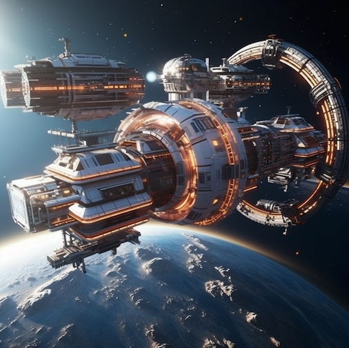

  

# Разработка системы управления космической станцией

В далеком будущем, группа межгалактических исследователей строит космическую станцию на орбите новооткрытой планеты. Команда состоит из ученых, инженеров и космонавтов. Чтобы эффективно управлять космической станцией, команде требуется специализированная система управления. Твоей задачей будет создать систему, которая учитывает структуру станции, ресурсы, оборудование и экипаж.

> *Система должна быть построена с использованием принципов объектно-ориентированного программирования. Тебе нужно будет продемонстрировать понимание и применение таких 
>  понятий, как классы, синтаксис "class", работа с экземплярами, наследование классов и композиция.*

**Погнали!**

> **ВНИМАТЕЛЬНО ИЗУЧИ ТЕСТЫ и runner.js перед тем как писать код**
 

## Release 0 - Создание основных классов
Тебе предстоит создать надежную и эффективную космическую станцию, но прежде чем отправиться в это невероятное приключение, тебе нужно создать основные строительные блоки станции – классы! Ты познакомишься с членами экипажа, ресурсами, оборудованием и задачами. Ведь даже в космосе без хорошего кода и строительных блоков никуда! 
> *Помни, что твой код должен быть чистым, как космическая пустота.*

- Создай класс *CrewMember*, который имеет свойства `name`, `role`, `experienceLevel` и `assignedTasks` (список задач).
- Создай класс *Resource*, который имеет свойства `name`, `quantity`, `consumptionRate` и `storageLocation`.
- Создай класс *Equipment*, который имеет свойства `name`, `status` (работает/не работает) и `location`.
- Создай класс *Task*, который имеет свойства `name`, `description`, `assignedCrewMember`, `requiredResources` и `requiredEquipment`.

## Release 1 - Работа с экземплярами и наследование

Пришло время углубиться в мир космических героев, их нужд и возможностей. Ты встретишь ученых, инженеров и астронавтов – твоих верных спутников в этом долгом путешествии. Не забудь также о важных ресурсах, как топливо и еда, ведь без них твоя станция превратится в космический мусор! 
> *Наследование – твой космический молоток для создания более специализированных классов.*

1. Создай класс *Scientist*, который наследует от класса *CrewMember* и добавляет свойство `fieldOfStudy`.
2. Создай класс *Engineer*, который наследует от класса *CrewMember* и добавляет свойство `specialization`.
3. Создай класс *Astronaut*, который наследует от класса *CrewMember* и добавляет свойство `spacewalkExperience`.
4. Создай класс *Fuel*, который наследует от класса *Resource* и добавляет свойство `fuelType`.
5. Создай класс *Food*, который наследует от класса *Resource* и добавляет свойство `expirationDate`.

## Release 2 - Работа с классами и композиция

Космическая станция начинает принимать форму, и тебе нужно добавить магический ингредиент – композицию! Это поможет тебе организовать работу станции и наладить взаимодействие между различными элементами. С помощью композиции ты сможешь связать задачи с экипажем, ресурсами и оборудованием, создавая неповторимую мелодию космической гармонии. 

> *Пора показать вселенной, что ты умеешь работать слаженно и продуктивно!*

1. В классе *Task*, добавь методы `assignCrewMember()`, `addRequiredResource()`, `addRequiredAction()` и `addRequiredEquipment()`, которые принимают соответствующие объекты и добавляют их в свойства `assignedCrewMember`, `requiredResources` и `requiredEquipment`.
2. Создай класс *SpaceStation*, который имеет свойства `crewMembers`, `resources`, `equipment` и `tasks`.
3. В классе *SpaceStation*, добавь методы для добавления членов экипажа, ресурсов, оборудования и задач.

## Release 3 - Расширение функционала и повышенная сложность

Твоя станция стала настоящим произведением искусства, и настало время протестировать ее возможности! Ведь как известно, настоящий мастер-класс проявляется в чрезвычайных ситуациях. Протоколы безопасности и аварийные задачи – твой лакмусовый тест для проверки качества работы. Пора узнать, сможет ли твоя станция справиться с непредвиденными обстоятельствами, и сможешь ли ты сохранить спокойствие и продолжать писать превосходный код даже в самых сложных условиях! 
> *Не забывай о том, что хороший программист – как опытный астронавт: всегда готов к неожиданным проблемам и находит решения в космической темноте! Вперед, к звездам и славе, но помни, что твой самый верный спутник – твой лучший код!*

1. В классе *SpaceStation*, добавь метод `runTask()`, который принимает объект класса Task и проверяет, есть ли все необходимые ресурсы и оборудование для выполнения задачи, а также опыт члена экипажа. Если все условия выполнены, задача выполняется, ресурсы расходуются, а оборудование и член экипажа обновляют свое состояние (если необходимо).
2. В классе *SpaceStation*, добавь метод `generateReport()`, который выводит отчет о текущем состоянии станции, включая информацию о членах экипажа, ресурсах, оборудовании и задачах.
3. Создай класс *EmergencyProtocol*, который имеет свойства `name`, `description`, `priorityLevel` (уровень приоритета) и `requiredActions` (список действий).
4. Создай класс *EmergencyTask*, который наследует от класса *Task* и добавляет свойство `emergencyProtocol`, принимающее объект класса EmergencyProtocol.
5. В классе *SpaceStation*, добавь метод `triggerEmergency()`, который принимает объект класса *EmergencyTask* и выполняет его, учитывая приоритет задачи и производя необходимые действия для выполнения протокола чрезвычайной ситуации.
6. Добавь в класс *SpaceStation* метод `simulateEmergency()`, который генерирует случайную чрезвычайную ситуацию и вызывает метод `triggerEmergency()` для ее решения. После завершения чрезвычайной ситуации, система должна автоматически обновить состояние станции, ресурсов, оборудования и экипажа.

### Ты очень крут!

После завершения всех релизов, ты должен иметь полноценную систему управления космической станцией, которая учитывает членов экипажа, ресурсы, оборудование, задачи и чрезвычайные ситуации. Эта система должна позволять эффективно управлять ресурсами станции, распределять задачи между членами экипажа, контролировать состояние оборудования и обеспечивать безопасность и эффективность работы станции.

> **Не забудь сделать pull request!** 
