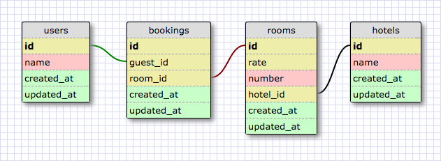

# Отели
Поработай с моделями и ассоциациями между ними. Нужно смоделировать данные для полноценного приложения, которое позволяет забронировать номера в отеле. Отели регистрируют свои номера в нашей системе, и после этого пользователи могут забронировать эти номера.

Дизайн схемы для этой задачи:

Пока не нужно беспокоиться о датах бронирования и других деталях, которые важны в реальном мире. Сосредоточься на том, как связать модели друг с другом.

## Проверочные вопросы
Когда ты создашь модели и ассоциации между ними, проверь свою систему следующими вопросами.

### Для пользователя
1. Какие заказы были сделаны пользователем?
2. Какие номера забронировал пользователь?
3. В каких отелях пользователь забронировал номер?

### Для отеля
1. Какие номера имеются в отеле?
2. Какие заказы были сделаны в отеле?
3. Какие гости заказали номера в отеле?

### Для комнаты
1. В каком отеле находится номер?
2. Какое бронирование этого номера было сделано?

### Для администратора системы
1. Для какого гостя было сделано это бронирование?
2. Какой номер был забронирован?
3. В каком отеле было сделано бронирование?

## Release 0. Подготовить проект
Проверь:
- ты можешь установить зависимости в проект
- все зависимости установлены
- зависимости не попадают в репозиторий
- ты используешь ESLint и твои файлы не содержат ошибок линтера
- соединение к БД настроено и работает

Попробуй разобраться с тем, как хранить реквизиты подключения за пределами кода. Например, ты можешь использовать переменные окружения. Отведи на эту задачу не более 30 минут — мы ещё будем её разбирать в другой день.

## Release 1. Создать модели
Создай все необходимые модели с помощью Sequelize CLI. Посмотри на дизайн схемы, определи, какие сущности должны быть в системе, и создай модель для каждой из них.

Сделай коммит.

## Release 2. Организовать ассоциации
Укажи в моделях ссылки на другие модели. Используй дизайн схемы и проверочные вопросы, чтобы определить, какие ассоциации нужны.

Сделай коммит.

## Release 3. Заполнить БД тестовыми данными
Заполни БД тестовыми данными — попробуй разобраться с seeders для этого.

Либо ты можешь использовать методы моделей для создания записей в БД.

Сделай коммит.

## Release 4. Проверить ассоциации
Напиши проверочный код для ответа на все поставленные вопросы. Если можешь получить корректные ответы с помощью своей системы, твои ассоциации построены верно.

Исправь ошибки с ассоциациями, если они есть. Изменяй тестовые данные, если будет необходимо.

Сделай коммит.

## Release 5. Подготовить код к PR
Проверь все свои файлы и убедись, что они не содержат ошибок линтера. Проверь, что зависимости не попали в репозиторий.

Исправь все ошибки, если они есть.

Сделай коммит и PR.
